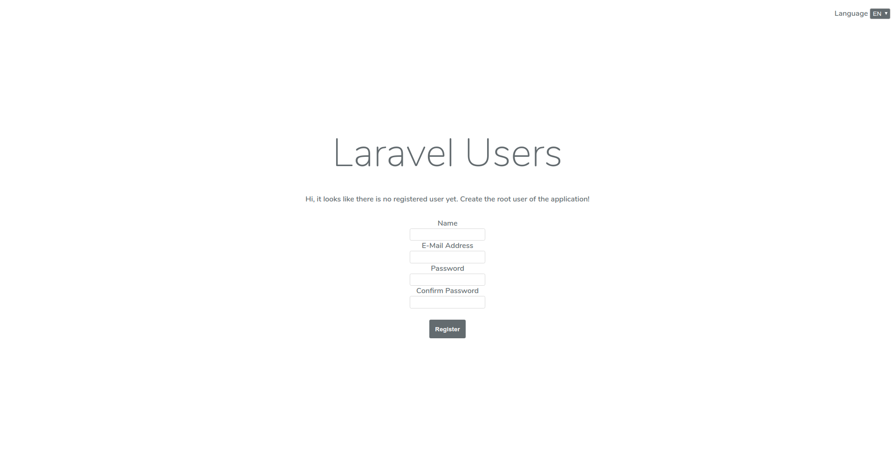
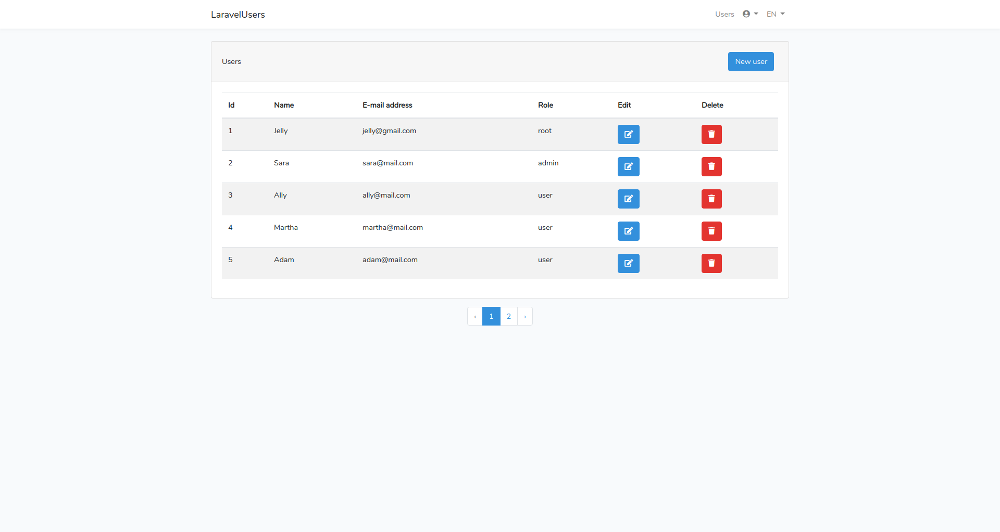
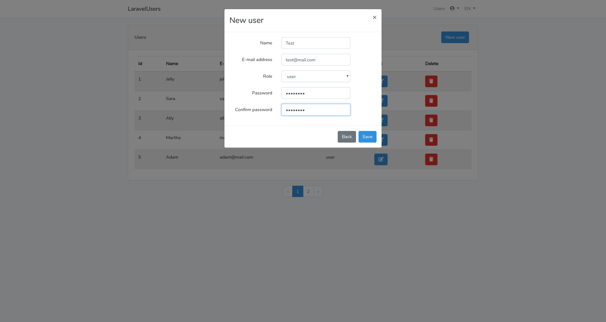
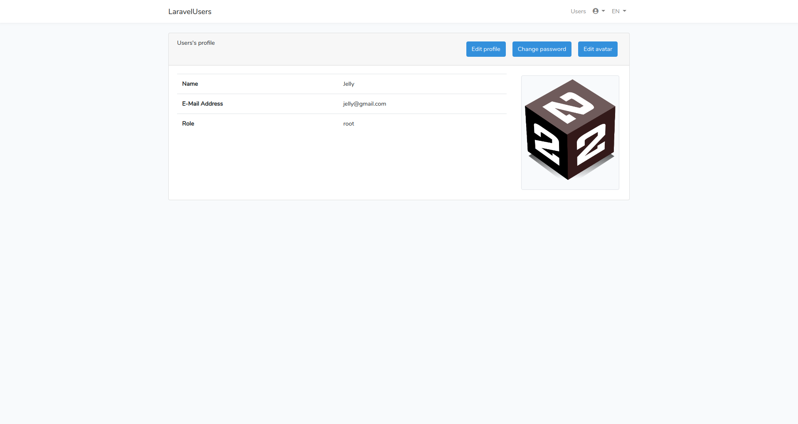
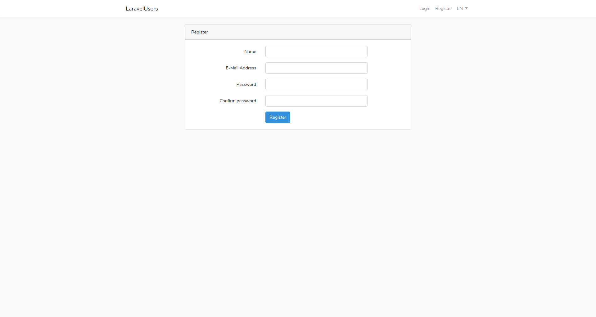

# Laravel Users

A simple project based on Laravel. I did the project in order to learn some basic topics related to creating applications using this framework. Mainly I wanted to learn things like:

* Using the repository pattern,
* Using middleware to switch application locale,
* Using Laravel authorization policies,
* Using Laravel service container and service providers,
* Writing tests using Mockery and Faker,
* Using request forms to validate incoming data,
* Uploading, storing and displaying images.

The application uses Laravel's built-in user authentication and additionally allows adding, deleting and editing users data. Every user has role assigned. Users rights to add, delete and edit other users depend on the roles they have assigned. Each user has access to their profile where they can change their data, login, password and avatar. Root administrator and administrators can manage other users.

Below are some screenshots from the application:

------------------------------------------------

Prosty projekt oparty o Laravel. Projekt zrobiłem w celu nauczenia się kilku podstawowych zagadnień związanych z tworzeniem aplikacji z wykorzystaniem tego frameworka. Głównie chodziło mi o nauczenie się rzeczy takich jak:
* Wykorzystanie wzorca projektowego repozytorium,
* Wykorzystanie middleware do zmiany języka w którym wyświetlane są informacje dla użytkowników,
* Wykorzystanie polityk autoryzacyjnych
* Wykorzystanie service containera i service providerów,
* Pisanie testów z wykorzystaniem Mockery i Fakera,
* Wykorzystanie form requestów do walidacji danych przychodzących w formularzach,
* Upload plików graficznych.

Aplikacja wykorzystuje wbudowany w Laravel system autentykacji użytkowników oraz dodatkowo umożliwia dodawanie, usuwanie oraz edycję danych użytkowników. Użytkownicy mają przypisane role. Uprawnienia użytkowników do dodawania, usuwania oraz edycji innych użytkowników uzależnione są od ról, które mają przypisane. Każdy użytkownik posiada dostęp do swojego profilu gdzie może zmienić swoje dane, hasło do logowania oraz avatar. Główni administratorzy oraz administratorzy mogą zarządzać innymi użytkownikami. 

Poniżej znajduje się kilka screenów z aplikacji:

